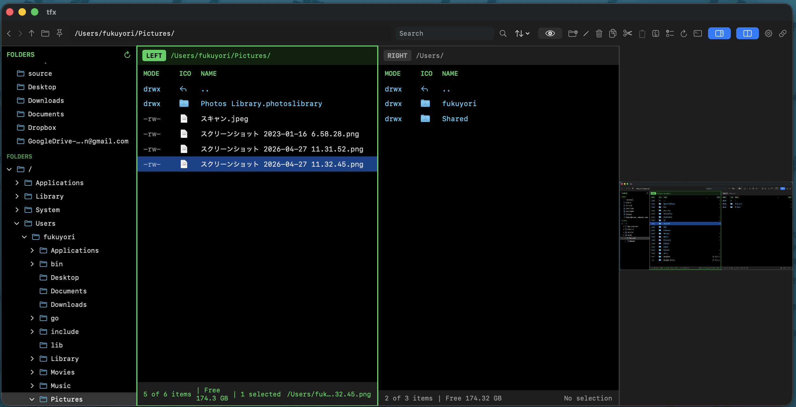

# tfx

**Terminal-inspired interface File eXplorer**<br>
Pronunciation: **Tafix**<br>
Version: **0.7.9**

English | [日本語](README.ja.md)

`tfx` is a macOS file manager with a terminal-inspired interface and keyboard-first workflow. It combines a folder tree, split file panes, rich previews, drag and drop, and terminal app integration.

## Screenshot



## Features

- Terminal-style file list UI
- Single folder tree rooted at `/`
- Persistent pinned folders section
- Home, Documents, and Downloads are pinned by default on first launch
- Drag reordering for pinned folders
- Toggleable folder tree (toolbar, View menu, or `cmd+option+f`)
- Single-pane and equal-width split-pane modes
- Per-pane folder tabs
- Drag and drop between left and right file panes
- Option-drag copies files; normal drag moves files
- Visual highlighting for the active view
- `..` row for parent-folder navigation
- Backspace parent-folder navigation
- Clickable breadcrumb path navigation
- PDF, video, Markdown, and Quick Look previews
- Toggle between rendered and source view for Markdown, HTML, CSV, and JSON previews
- CSV / TSV preview as a scrollable table; JSON preview as pretty-printed text
- Plain-text preview for TOML, YAML, INI, log, and similar config formats
- Compact preview metadata for selected files and folders
- Toggleable preview pane
- Browse zip archives without extracting them
- Copy files from browsed zip archives
- Open a terminal app at the current folder
- Built-in command terminal pane that starts in the active folder and accepts file/folder drops onto the terminal to insert shell-quoted paths
- New File, New Folder, inline Rename, Move to Trash, and Reveal in Finder
- "Open With" submenu listing applications that can open the file, with an "Other…" picker
- Auto-refresh: each file pane updates automatically when its directory changes externally
- Compress selected items to a zip archive
- Extract zip archives
- Copy, Cut, Paste, Finder pasteboard interoperability, and same-name conflict handling
- Finder aliases and directory symlinks are resolved for navigation
- Search, hidden-file toggle, and sorting
- Multi-selection with Command-click
- Range selection with Shift + arrow keys, Shift-click, and mouse drag
- Subfolder search with progress and cancellation
- File-type icons in the file list
- Configurable file-list columns: visibility and order
- User-editable `config.toml` for design settings and shortcut overrides
- Finder-compatible tags: tag column, standard color tags, and custom tag names from the file-row context menu
- Resizable file-name column by dragging the `NAME` header
- Restores window size, visible panes, pane widths, active pane, and open folders

## Keyboard

- `Up / Down`: Move selection in the active file pane or folder tree
- `Shift + Up / Down`: Extend the file-pane selection range
- `Left / Right`: Scroll the file list horizontally
- `Tab` / `Shift + Tab`: Cycle keyboard focus across left file pane → right file pane → built-in terminal (when visible). The folder tree is reachable by mouse click but does not participate in Tab cycling.
- `Enter`: Open the selected file or enter the selected folder
- `Command + O`: Open the selected item
- `Command + [` / `Command + ]`: Back / Forward
- `Command + Up`: Parent folder
- `Backspace`: Parent folder
- `Command + F`: Search
- `Command + N`: New folder
- `Command + Shift + N`: New file
- `Command + Return`: Rename inline
- `Command + Backspace`: Move to Trash
- `Command + C / X / V`: Copy / Cut / Paste
- `Command + Option + V`: Move-paste
- `Command + A`: Select all
- `Command + R`: Reload
- `Command + T`: Open a terminal app here
- `Command + P`: Toggle preview pane
- `Command + \`: Toggle split view
- `Command + Shift + X`: Swap left and right panes (split view only)
- `Command + Shift + .`: Toggle hidden files
- `Command + Shift + T`: New tab
- `Command + W`: Close tab
- `Command + Shift + [` / `Command + Shift + ]`: Previous / next tab
- `Command + Option + T`: Toggle built-in terminal pane
- `Command + Option + Shift + T`: Focus built-in terminal pane

## Command Line Launch

Open the installed app at the current directory:

```sh
open -a tfx "$PWD"
```

Open a specific directory:

```sh
open -a tfx /path/to/folder
```

Show the installed app version:

```sh
/Applications/tfx.app/Contents/MacOS/tfx -v
```

Show command-line help:

```sh
/Applications/tfx.app/Contents/MacOS/tfx -h
```

Startup layout and pane visibility can be overridden for one launch:

```sh
tfx -1                 # --single
tfx -2                 # --split
tfx -r                 # --restore
tfx -p                 # --preview
tfx -P                 # --no-preview
tfx -t                 # --terminal
tfx -T                 # --no-terminal
tfx -2 -P -t ~/Downloads
```

Do not use `-n` or `--args`; pass the folder as the item for `open` instead. `--args` is treated as a launch argument and does not use macOS's normal folder-open path.

If `open -a tfx` cannot find the app, or launches a different build, pass the app path directly:

```sh
open -a /Applications/tfx.app "$PWD"
```

If you have a wrapper such as `/usr/local/bin/tfx`, relative paths are supported:

```sh
tfx .
```

## Configuration

tfx creates and reads its user configuration from:

```text
~/Library/Application Support/tfx/
```

The current configuration supports compact `[font]`, `[colors]`, `[opacity]`,
`[shortcuts]`, `[terminal]`, `[openWith]`, and `[[commands]]` blocks in `config.toml`:

```toml
version = 1

[font]
ui = "system"
mono = "monospace"
size = 13

[colors]
fileListBackground = "#020A12"
fileForeground = "#D6F7FF"
directoryForeground = "#66D9FF"
headerForeground = "#8AEFFF"

[opacity]
background = 1
inactivePane = 0.5

[shortcuts]
reload = "cmd+shift+r"
togglePreview = "cmd+option+p"

[terminal]
app = "/Applications/Ghostty.app"

[openWith]
md = "com.microsoft.VSCode"
pdf = "/Applications/Preview.app"

[[commands]]
name = "Git Pull"
run = "git -C {cwd} pull --ff-only"
target = "current"
requireGit = true
terminal = true
shortcut = "cmd+shift+g"
```

See [`docs/configuration.md`](docs/configuration.md) for supported keys, design token mapping, examples, and error handling.
Japanese documentation is available at [`docs/configuration.ja.md`](docs/configuration.ja.md).

## Build

```sh
xcodebuild -project tfx.xcodeproj -scheme tfx -destination 'platform=macOS' -derivedDataPath /tmp/tfx-derived CODE_SIGNING_ALLOWED=NO build
```

Release build:

```sh
xcodebuild -project tfx.xcodeproj -scheme tfx -configuration Release -destination 'platform=macOS' -derivedDataPath /tmp/tfx-release-derived CODE_SIGNING_ALLOWED=NO build
```

## Project Structure

Source directories:

- `tfx/App`: App entry points and root view wiring
- `tfx/TerminalFileManager`: Top-level file manager screen, controls, keyboard routing, and layout state
- `tfx/FileBrowser`: File browser model, directory loading, selection, file operations, zip archive browsing, metadata, and drag/drop behavior
- `tfx/FilePane`: File list panes, rows, headers, menus, settings, and status line
- `tfx/FolderTree`: Folder tree and pinned-folder UI
- `tfx/Preview`: Preview pane, Markdown/PDF/video/Quick Look previews, preview metadata, and preview type selection
- `tfx/Infrastructure`: Small reusable AppKit and SwiftUI helpers
- `tfx/Assets.xcassets/AppIcon.appiconset`: App icon assets

Supporting directories:

- `tools/generate_app_icon.swift`: App icon regeneration script
- `CHANGELOG.md`: Release history

## Documentation

See `docs/README.md` for the documentation index, maintenance rules, source layout guide, detailed design, implementation history, and roadmap.

## Notes

- Delete-like operations use the macOS Trash instead of permanent deletion.
- Previews use PDFKit, AVKit, WebKit, and Quick Look.
- Date display uses `yyyy-MM-dd HH:mm:ss`.
